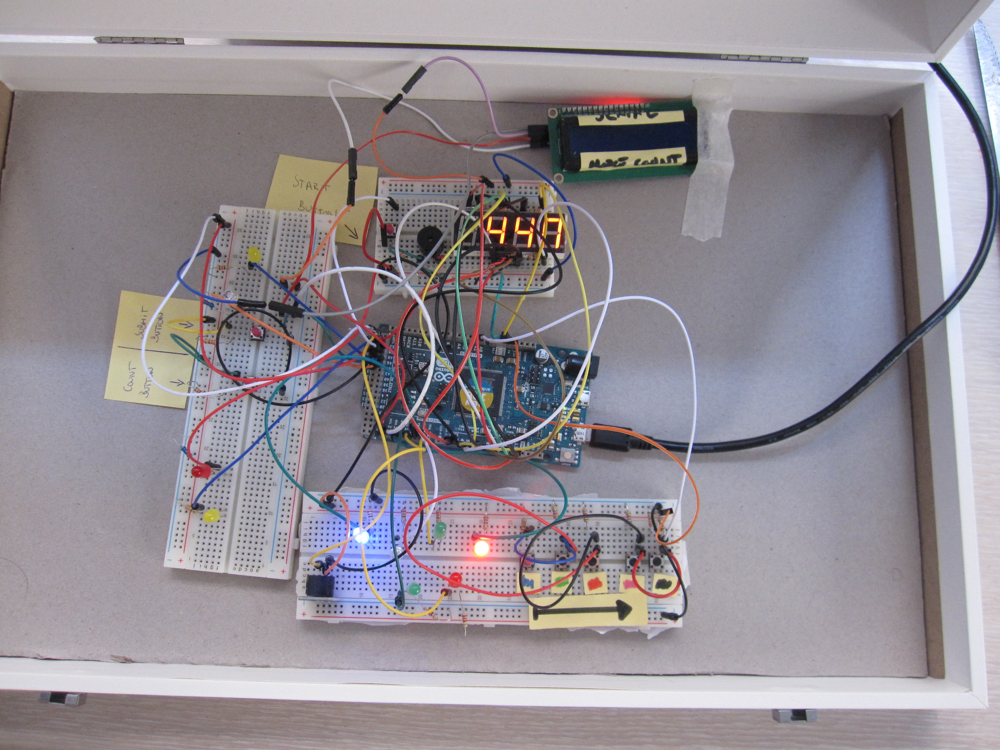

## Bomb Defuse Game ! 
#(based on 'Keep Talking And Nobody Explodes')

## Dependencies

- [AnalogMultiButton](https://github.com/dxinteractive/AnalogMultiButton)
- [LiquidCrystal_I2C](https://github.com/marcoschwartz/LiquidCrystal_I2C)
- [SevSeg](https://github.com/sparkfun/SevSeg)

## Building the circuit

- Global Circuit

## Playing

- It's a coop game.

- One player is in front of the bomb but does not see it, while the other communicates the instructions to defuse it.

- For more information, see "manuel" folder.
